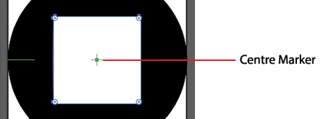
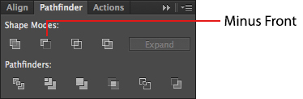
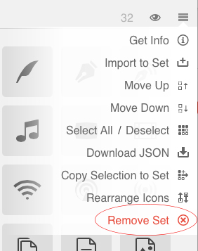
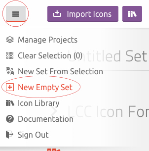
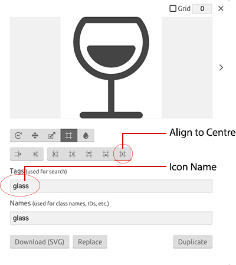
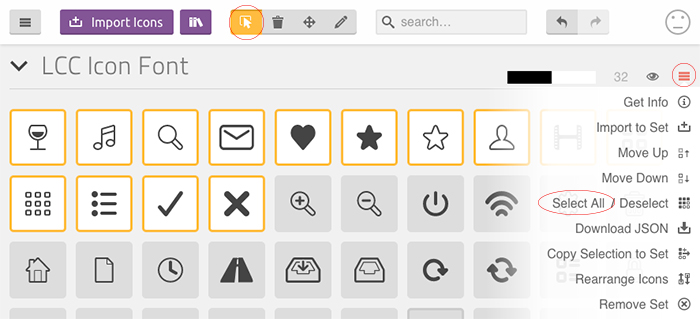
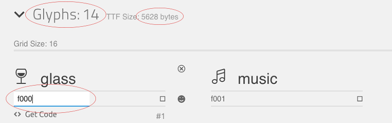

# LCC Icon Set Documentation

Alongside this documentation you will find a folder named **AI Files**, this folder contains several LCC icon sets that can be edited. There is also a blank template named **Template - LCC Icon Set**, this can be used when creating a new set of icons. Each file contains around 60 artboards and each artboard will contain a single icon. 

If you find Adobe Illustrator is running slow when using the template, feel free to delete several artboards until you have a smoother running application. This can be done by selecting the **Artboard Tool** from the tools menu (usually located on the far left), then selecting the artboard and pressing the **Back Space** button the keyboard. This can also be achieved by opening the artboard menu (**Windows > Artboards**).

## Creating An Icon From Scratch

Open up the blank template within the **AI Folder** and zoom into a single artboard using the **Zoom Tool**, once you have a clear view of the artboard you will be ready to start drawing out an icon. You can create an icon using a verity of tools, for this example we will create a simple stop button icon.

Select the **Ellipse Tool** from the tools menu and draw a circle on the artboard, making sure the circle has no stroke and only a black fill. The circle should also fit the whole artboard, making sure all sides of the circle are aligned to each side of the artboard.

You can centre an icon so that all four squares (shown in the red circles) are aligned with each green cross hair. If the icon is larger in width, you can select the **Artboard Tool** and change the width of the artboard until the icon fits within the artboard.

**Note:** Do **NOT** change the height of the artboard.

Now select the **Rounded Rectangle Tool**, this can be found in the same place as the Ellipse Tool. Create a rounded square and centre it within the black circle. Remember, you can centre the square by using the green marker within the centre of the artboard.

Once you have centred the square, open up the pathfinder window (**Windows > Pathfinder**) and select both the circle and square together. Now navigate to the pathfinder panel and select the **Minus Front** option. The small centre square within the large white square will disappear, this means the black circle will now have a square shape cut out of it in the position you originally placed it in.

You can now select the icon and expand it (**Options > Expand**), this will break apart the icon so it can be exported as an SVG. This process can also be applied to fonts using the **Text Tool**.

Before you save the icon(s) as an SVG you should create a folder for them, so that when you save all the icons they do not clutter the desktop.

Now that the icon has been created you can save it as an SVG. Go to **File > Save As** and select SVG from the dropdown menu, also making sure you tick the **Use Artboards** option. If you create multiple icons within the one template make sure **All** has been selected, this is usually activated by default when selecting the Use Artboards option. By doing this you can save all the icons in one go rather than individually, you can also select **Range** if you want to save specific icons from the template.

After you click the save button you will be prompted with a pop-up menu, providing you with several options. The options have been listed below.

* **SVG Profile:** SVG 1.1
* **Type:** SVG
* **Subsetting:** Only Glyphs Used
* **Image Location:** Embed
* Make sure **Preserve Illustrator Editing Capabilities** is un-ticked

The **More Options** can be left as default.

# Creating The Font Set

Now that the icons have been saved as an SVG, we can use online software to help us set-up the icons as a font set, similar to how Font Awesome works. When you visit the website make sure to sign-up for a new account. Once this has been done, **go back to the home page** so that you can follow the instructions properly.

**IMPORTANT -** All projects within icoMoon are saved locally and are stored within the cache; if you clear the computers cache your project will be lost. This is because we are using the free version, only premium members can back-up their projects online.

URL: [www.icomoon.io](https://icomoon.io/)

## Environment Set Up

From the home page click on the **IcoMoon App** button, located at the top right corner of the page. This will take you to the icon workspace, where you will import all the icons. If you see a set of free icons already places within the page, feel free to remove them by going to the menu on the right and selecting **Remove Set**.

To create a new icon set you must click on the menu located within the top left corner of the page and select **New Empty Set**. This will automatically create a project, where you can add, edit and remove icons. The new project should be named **Untitled Set** by default.

Before any icons are imported we should fill-in the meta information for this project, as this will help us define the project when exporting it.

Click on the project menu and select **Get Info**, this will show a pop-up with multiple fields. Click on **Edit Metadata** and fill-in the required information.

## Importing Icons

There are two ways of importing icons into a project, the first and probably the easiest way is to simply highlight all the exported SVG icons and drag them over the project you have just created. The second solution is to click the **Import Icons** button at the to top of the page, locating the SVG icons and selecting which icons you want importing.

**Note:** If there are any problems with the icons you have created, IcoMoon will prompt you with an error. Go through the icons and find out which icon has not been set-up properly. The most common problems seem to occur when the icon path has not been combined as one object, which means it will not expand properly.

## Editing Icons

Now that you have all the icons ready and imported you will see them listed within the project, and each icon will need  editing to ensure consistency. This can be done by using the icon toolbar at the top of the page next to the search field.

Click on the **Edit** button (pencil icon) and select the icons you need to edit. Please be aware that any **new** icons will need editing, as all the default LCC icons have been edited to keep all positioning consistent.

A window should appear with a range of simple editing tools, so to start off give the icon a meaningful name making sure you keep it all in lower case. Seen as how most of the editing was originally done in Illustrator, the new icons will only need the positioning tweaked and you can do this by clicking **Canvas/Alignment** tool, then selecting the **Align to Centre** option.

## Generate Font

Once you have all the icons imported and edited, select the icons you want to export as a new font. You can do this by either clicking the **Select** tool from the top menu, or you can go to the project menu and choose **Select All**.

Now that you have the icons selected, click on the **Generate Font** tab located at the bottom right of the page.

This section will show you how many Glyphs (icons) you have, how large the file will be when exported and will allow you to change the Unicode on each icon. The Unicode will be added automatically, but if the Unicode does need changing for any specific reason it can be done on this page.

Before we finish we need to check a few more settings, you can do this by clicking the **Preferences** button at the top of the page. This will open a new window that contains a few important setting we need to check, I've listed the settings below and anything else can be left as default.

* Class Prefix:                     **icon-**
* Support IE 8:                     **Yes**
* Support IE 7 & IE 6:              **No**
* Include Metadata in Fonts:        **Yes**
* Generate Stylesheet Variables:    **No**

CSS Selector
* Use Attribute Selector:            **Yes**

Font Metrics
* Em Square Height (Power of 2):    **1024**
* Baseline Height (% Em):           **1**
* Whitespace Width (% Em):          **0**

Now that all the basics are set-up we should be ready to export the project as a font.

Select the icons you want to export then go to the **Generate Font** tab at the bottom of the page. When you click on the tab it will change to a download button, click the download button and download the new custom font.

The downloaded font will generate a demo page, and this page can be used as a reference the names of each icon. The demo page is also an example of how the new icons are being displayed.

