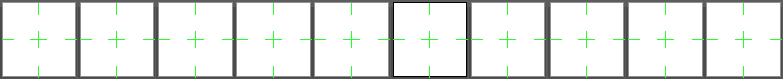
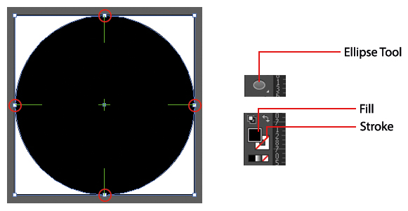

# LCC Icon Set Documentation

Alongside this documentation you will find a folder named **AI Files**, this folder contains several LCC icon sets that can be edited. There is also a blank template named **Template - LCC Icon Set**, this can be used when creating a new set of icons. Each file contains around 60 artboards and each artboard will contain a single icon. 

If you find Adobe Illistator is running slow when using the template, feel free to delete several artboards until you have a smoother running application. This can be done by selecting the **Artboard Tool** from the tools menu (usually located on the far left), then selecting the artboard and pressing the **Back Space** botton the keyboard. This can also be achieved by opening the artboard menu (**Windows > Artboards**).

## Creating An Icon From Scratch

Open up the blank template within the **AI Folder** and zoom into a single artboard using the **Zoom Tool**, once you have a clear view of the artboard you will be ready to start drawing out an icon. You can create an icon using a verity of tools, for this example we will create a simple stop button icon.

Select the **Ellipse Tool** from the tools menu and draw a circle on the artboard, making sure the circle has no stroke and only a black fill. The circle should also fit the whole artboard, making sure all sides of the circle are aligned to each side of the artboard.

<note>You can centre an icon so that all four squares (shown in the red circles) are aligned with each green cross hair. If the icon is larger in width, you can select the **Artboard Tool** and change the width of the artboard until the icon fits within the artboard.  
Do **NOT** change the hight of the artboard.</note>

Now select the **Rounded Rectangle Tool**, this can be found in the same place as the Ellipse Tool. Create a rounded square and centre it within the black circle. Remember, you can centre the square by using the green marker within the centre of the artboard.

