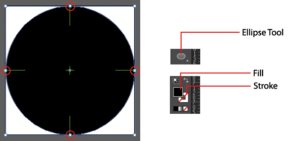

# LCC Icon Set Documentation

Alongside this documentation you will find a folder named **AI Files**, this folder contains several LCC icon sets that can be edited. There is also a blank template named **Template - LCC Icon Set**, this can be used when creating a new set of icons. Each file contains around 60 artboards and each artboard will contain a single icon. 

If you find Adobe Illustrator is running slow when using the template, feel free to delete several artboards until you have a smoother running application. This can be done by selecting the **Artboard Tool** from the tools menu (usually located on the far left), then selecting the artboard and pressing the **Back Space** button the keyboard. This can also be achieved by opening the artboard menu (**Windows > Artboards**).

## Creating An Icon From Scratch

Open up the blank template within the **AI Folder** and zoom into a single artboard using the **Zoom Tool**, once you have a clear view of the artboard you will be ready to start drawing out an icon. You can create an icon using a verity of tools, for this example we will create a simple stop button icon.

Select the **Ellipse Tool** from the tools menu and draw a circle on the artboard, making sure the circle has no stroke and only a black fill. The circle should also fit the whole artboard, making sure all sides of the circle are aligned to each side of the artboard.

You can centre an icon so that all four squares (shown in the red circles) are aligned with each green cross hair. If the icon is larger in width, you can select the **Artboard Tool** and change the width of the artboard until the icon fits within the artboard.

Do **NOT** change the height of the artboard.

Now select the **Rounded Rectangle Tool**, this can be found in the same place as the Ellipse Tool. Create a rounded square and centre it within the black circle. Remember, you can centre the square by using the green marker within the centre of the artboard.

Once you have centred the square, open up the pathfinder window (**Windows > Pathfinder**) and select both the circle and square together. Now navigate to the pathfinder panel and select the **Minus Front** option. The small centre square within the large white square will disappear, this means the black circle will now have a square shape cut out of it in the position you originally placed it in.

You can now select the icon and expand it (**Options > Expand**), this will break apart the icon so it can be exported as an SVG. This process can also be applied to fonts using the **Text Tool**.

Before you save the icon(s) as an SVG you should create a folder for them, so that when you save all the icons they do not clutter the desktop.

Now that the icon has been created you can save it as an SVG. Go to **File > Save As** and select SVG from the dropdown menu, also making sure you tick the **Use Artboards** option. If you create multiple icons within the one template make sure **All** has been selected, this is usually activated by default when selecting the Use Artboards option. By doing this you can save all the icons in one go rather than individually, you can also select **Range** if you want to save specific icons from the template.

After you click the save button you will be prompted with a pop-up menu, providing you with several options. The options have been listed below.

* **SVG Profile:** SVG 1.1
* **Type:** SVG
* **Subsetting:** Only Glyphs Used
* **Image Location:** Embed
* Make sure **Preserve Illustrator Editing Capabilities** is un-ticked

The **More Options** can be left as default.

# Creating The Font Set

Now that the icons have been saved as an SVG, we can use online software to help us set-up the icons as a font set, similar to how Font Awesome works. When you visit the website make sure to sign-up for a new account. Once this has been done, **go back to the home page** so that you can follow the instructions properly.

URL: [www.icomoon.io](https://icomoon.io/)

## Environment Set Up

From the home page click on the **IcoMoon App** button, located at the top right corner of the page. This will take you to the icon workspace, where you will import all the icons. If you see a set of free icons already places within the page, feel free to remove them by going to the menu on the right and selecting **Remove Set**.

To create a new icon set you must click on the menu located within the top left corner of the page and select **New Empty Set**. This will automatically create a project, where you can add, edit and remove icons.

The new project which is named 

